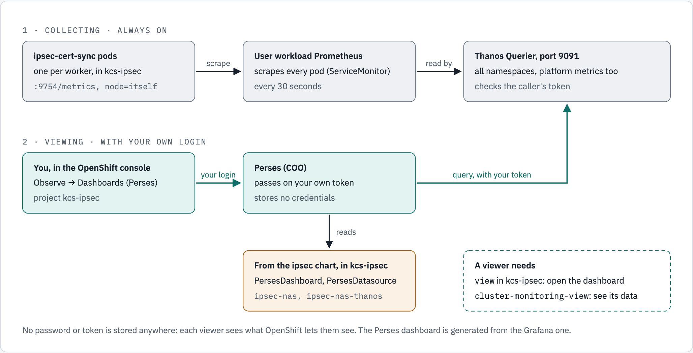

# openshift-coo-helm

A Helm chart to install Red Hat's **Cluster Observability Operator (COO)** on OpenShift, hands-free, as a platform component of its own. COO brings **Perses**: dashboards in the OpenShift console, under **Observe → Dashboards (Perses)**, that each application keeps in its own namespace.

Applications consume this platform piece, and keep their own dashboards in their own repositories. The first is [openshift-ipsec-nas](https://github.com/ephico2real2/openshift-ipsec-nas): see [the example](#example-openshift-ipsec-nas).

**Status:**
- **The chart, [`charts/openshift-coo`](charts/openshift-coo/README.md), installs COO with Perses hands-free** from Helm or Argo CD, on OpenShift 4.19 or later. Measured on OpenShift Local (CRC 4.22.7) with COO 1.5.2 and 1.5.3: clean install, re-run, upgrade, uninstall and reinstall ([evidence 11](docs/evidence/crc/11-chart-on-crc.txt)).
- **The chart [`charts/openshift-user-workload-monitoring`](charts/openshift-user-workload-monitoring/README.md) holds the settings of user workload monitoring** (the ConfigMap `user-workload-monitoring-config` in `openshift-user-workload-monitoring`) in values, from Helm or Argo CD, on OpenShift 4.18 or later. Measured on CRC 4.22.7: adoption of the operator's ConfigMap, upgrade, uninstall, Argo CD; nothing in `openshift-monitoring` changed ([evidence 14](docs/evidence/crc/14-user-workload-monitoring-chart.txt)).
- **How COO behaves**, installed and studied by hand first: [manual-install findings](docs/manual-install-findings.md).
- **The Grafana-to-Perses converter page** is planned in [issue #2](https://github.com/ephico2real2/openshift-coo-helm/issues/2).

## Install

Before relying on it, read the chart's [Limitations](charts/openshift-coo/README.md#limitations): OpenShift 4.19 or later, tested on one single-node cluster, one COO defect waiting on upstream.

```bash
helm install openshift-coo charts/openshift-coo -n platform-tools --create-namespace \
  --set 'metricsAccess.groups={system:authenticated}' --timeout 15m
```

Or with Argo CD: [`charts/openshift-coo/examples/argocd-application.yaml`](charts/openshift-coo/examples/argocd-application.yaml). Requires OpenShift 4.19 or later. Why, the COO defect the chart fixes, upgrades and uninstall: [the chart's README](charts/openshift-coo/README.md).

## How an application's dashboard reaches its viewers

<!-- markdownlint-disable MD033 -->
<picture>
  <source media="(prefers-color-scheme: dark)" srcset="docs/images/perses-dashboard-flow.dark.png">
  <source media="(prefers-color-scheme: light)" srcset="docs/images/perses-dashboard-flow.light.png">
  
</picture>
<!-- markdownlint-enable MD033 -->

*Figure 1. The sample: the ipsec application (namespace `kcs-ipsec`). Its source is the fourth figure of [openshift-ipsec-nas `docs/diagrams/ipsec-nas/source.html`](https://github.com/ephico2real2/openshift-ipsec-nas/blob/main/docs/diagrams/ipsec-nas/source.html). Measured on CRC 4.22.7 with COO 1.5.3.*

| Who | Provides |
|---|---|
| **This repository** (the platform) | COO with Perses enabled, in `openshift-cluster-observability-operator`; and `cluster-monitoring-view` for the viewers (`metricsAccess.groups`) |
| **Each application's chart** | Its ServiceMonitor, a `PersesDashboard` and a `PersesDatasource`, in its own namespace |
| **OpenShift** | User workload monitoring and Thanos Querier, already there |

Viewers need `view` in the application's namespace, which already lets them read its Perses dashboards, and `cluster-monitoring-view`. No token or password is stored anywhere: Perses passes each viewer's own login to Thanos.

## Example: openshift-ipsec-nas

The ipsec application encrypts NFS between OpenShift nodes and a NAS. It reports per-node IPsec metrics, and ships its dashboard for Perses, on by default:

| What | Where, in openshift-ipsec-nas |
|---|---|
| The two objects (`PersesDatasource` `ipsec-nas-thanos` on Thanos 9091, `PersesDashboard` `ipsec-nas`) | [`charts/ipsec-nas/templates/perses-dashboard.yaml`](https://github.com/ephico2real2/openshift-ipsec-nas/blob/main/charts/ipsec-nas/templates/perses-dashboard.yaml) |
| The switch, and its prerequisite check | `metrics.persesDashboard.enabled` (default `true`): the chart refuses to install without COO's API `perses.dev/v1alpha2`. `false` on a cluster without COO |
| The dashboard, generated from its Grafana one | [`scripts/perses-dashboard.sh`](https://github.com/ephico2real2/openshift-ipsec-nas/blob/main/scripts/perses-dashboard.sh) |
| How to use it: open, who sees it, change it, troubleshoot | [doc 61](https://github.com/ephico2real2/openshift-ipsec-nas/blob/main/docs/61-perses-dashboard-review.md) |

The sample objects, and how the dashboard was converted from Grafana: [docs/grafana-to-perses.md](docs/grafana-to-perses.md).

<!-- markdownlint-disable MD033 -->

<!-- markdownlint-enable MD033 -->

*The sample: the ipsec chart's `PersesDashboard` and `PersesDatasource` under **Observe → Dashboards (Perses)**, project `kcs-ipsec`, in its five sections, on CRC's data. "No data" on the last panel means no kernel IPsec errors: it shows only counters above 0. The console shell is the community (OKD) build of the same console, `quay.io/openshift/origin-console:4.22`, run on a laptop against CRC with sign-in turned off (hence the `okd` logo and "Auth disabled"). COO's console plugin, its Perses server, the dashboard and the data are CRC's own ([evidence 09](docs/evidence/crc/09-console-perses-capture.txt)).*

## Documents

| Document | What it covers |
|---|---|
| [charts/openshift-coo/README.md](charts/openshift-coo/README.md) | **The chart:** what it installs, Helm and Argo CD, values, upgrading COO, uninstalling and what stays, and the known issues (the COO defect it fixes, why OpenShift 4.19) |
| [charts/openshift-user-workload-monitoring/README.md](charts/openshift-user-workload-monitoring/README.md) | **The user workload monitoring chart:** why it can own the ConfigMap, installing over the operator's (`--take-ownership --force-conflicts`), values, Argo CD, upgrade and uninstall |
| [docs/manual-install-findings.md](docs/manual-install-findings.md) | COO installed by hand: the catalog, the Manual-approval install, what it adds to the cluster, enabling Perses, a COO defect and its fix (`clusterHealthAnalyzer`), how Perses reaches Thanos with each viewer's own token, the decision on Thanos 9091, and what a hands-free chart must do |
| [docs/grafana-to-perses.md](docs/grafana-to-perses.md) | **Converting a Grafana dashboard to Perses:** the steps, what the converter gets wrong and how to fix it, the two objects an application ships, who can see it, and how to verify it, all measured on the ipsec dashboard |
| [docs/percli.md](docs/percli.md) | Installing `percli` (the Perses CLI) on Linux and macOS: script, by hand, or the container image |
| [docs/evidence/crc/](docs/evidence/crc/) | The saved command output behind every statement |

## Scripts

| Script | What it does |
|---|---|
| [scripts/install-percli.sh](scripts/install-percli.sh) | Installs `percli` and its plugins (unpacked) for Linux or macOS (amd64, arm64) from the official release, after checking the SHA-256 |
| [scripts/refresh-uiplugin-crd.sh](scripts/refresh-uiplugin-crd.sh) | Refreshes the chart's copy of the UIPlugin CRD from a cluster running the COO version in `Chart.yaml` |
| [tests/test-chart.sh](tests/test-chart.sh) | The chart's tests: `helm lint`, renderings, the values schema, and `bash -n` and shellcheck on the Jobs' scripts |
