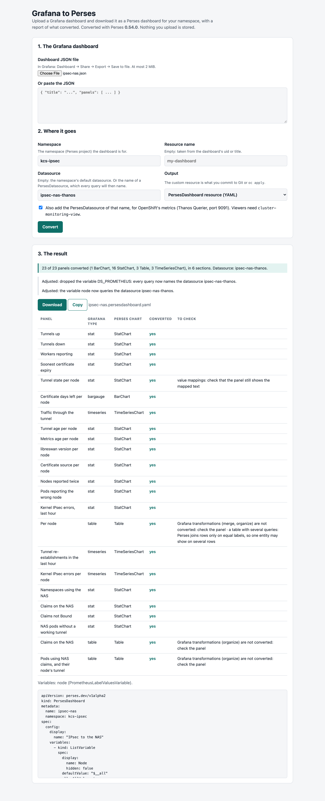
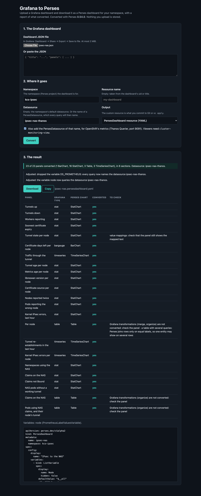

# The Grafana-to-Perses Converter Page

A web page, served from the cluster, that turns a Grafana dashboard into a Perses dashboard: upload the Grafana JSON, read what converted, download a `PersesDashboard` for your namespace. No `percli` to install and no cluster access needed to convert. It is an optional part of the [openshift-coo chart](../charts/openshift-coo/README.md), which also brings Perses itself (issue #2).

<!-- markdownlint-disable MD033 -->
| Light | Dark |
| --- | --- |
|  |  |
<!-- markdownlint-enable MD033 -->

*The page after one conversion, captured on CRC on 2026-10-06 from the deployed pod.*

## Turn it on

It is off by default. It needs a namespace that already exists (here `platform-tools`), and nothing else: it does not need COO to convert.

```yaml
converter:
  enabled: true
  namespace: platform-tools
```

With Helm, add those values to the release. With Argo CD, add them to the Application's `valuesObject` (the [example](../charts/openshift-coo/examples/argocd-application.yaml) shows them).

**Check it:**

```bash
oc rollout status deployment/perses-converter -n platform-tools
oc get route perses-converter -n platform-tools -o jsonpath='https://{.spec.host}{"\n"}'
```

Open that address. The OpenShift login appears first; any user who can log in may use the page.

## Use it

1. Choose the Grafana dashboard JSON file (in Grafana: Dashboard → Share → Export → Save to file), or paste the JSON.
2. Give the namespace the dashboard is for.
3. Leave **Datasource** empty to use the namespace's default datasource, or give the name of a `PersesDatasource`: every query will then name it. Tick the box to also get that `PersesDatasource`, on Thanos Querier's port 9091.
4. Press **Convert**, read the report, and **Download**.
5. Commit the file to your application's repository, or apply it: `oc apply -f <file>`. The dashboard then appears under **Observe → Dashboards (Perses)** in that project.

The report lists every panel with its Grafana type and its Perses chart, and what to check by hand:

| The report says | Meaning |
| --- | --- |
| not converted … a text placeholder | Perses has no chart for that Grafana panel type; redraw the panel |
| Grafana transformations … are not converted | The panel used transformations; check what it shows |
| value mappings: check … | Check that mapped text still shows |
| the unit … was not carried over | Set the unit on the panel |
| a table with several queries … | Perses joins table rows only on equal labels |

Viewers of a dashboard need `view` in its namespace and `cluster-monitoring-view` for its data: [the chart README](../charts/openshift-coo/README.md).

## How it works

One pod with three containers. None of the images is built here.

| Container | Image | Role |
| --- | --- | --- |
| `perses` | The official Perses image, `docker.io/persesdev/perses:v0.54.0` | The engine: its `/api/migrate` converts. Listens on the pod's loopback only |
| `web` | `ubi9/python-312` | The page, the report and the custom resource: `server.py` and `index.html`, mounted from a ConfigMap. Loopback only |
| `oauth-proxy` | `ose-oauth-proxy` | The OpenShift login, and the only port that leaves the pod. The Route re-encrypts to it |

`server.py` and `index.html` live in the chart under `files/converter/` and reach the ConfigMap through Helm's `.Files.Get`. A change to either restarts the pod.

**What the page adds to the engine:**

- the custom resource: `perses.dev/v1alpha2`, with the dashboard under `spec.config`, for the namespace you name;
- the report;
- with a named datasource: the name in every variable too (the engine leaves variables without one), and the unused Grafana input variable dropped. The report lists both under "Adjusted".

**What is not kept:** anything. The upload is parsed, converted and returned. The pod has a read-only root filesystem and no volume but memory, the request log has no bodies, and the login's session key is minted in memory at start (a restart signs everyone out; the next request logs them in again).

**The network policy:** in, only the routers, to the proxy's port. Out, DNS and TCP 443 and 6443, which the login needs. Converting needs no connection.

## The engine

The Perses version must be the one inside the installed COO: `converter.persesVersion`, 0.54.0 for COO 1.5.2 and 1.5.3 ([percli.md](percli.md)).

The official image's server and `percli migrate` offline give the same dashboard. Measured on the *IPsec to the NAS* dashboard (23 panels), with 0.54.0:

| Compared | Result |
| --- | --- |
| Server `/api/migrate` vs `percli migrate`, no option | Identical |
| Server with `useDefaultDatasource` vs `percli --use-default-datasource` | Identical |
| Server with `input: {DS_PROMETHEUS: <name>}` vs `percli --input DS_PROMETHEUS=<name>` | Identical |

This is the upstream image's server, not COO's own: COO's converter differs on tables ([grafana-to-perses.md](grafana-to-perses.md)).

## Values

| Value | Default | Meaning |
| --- | --- | --- |
| `converter.enabled` | `false` | Deploy the page |
| `converter.namespace` | empty: the release's namespace | Where it runs; it must exist |
| `converter.persesVersion` | `0.54.0` | The engine's version |
| `converter.maxUploadBytes` | `2097152` | The largest upload (2 MiB) |
| `converter.thanosURL` | Thanos Querier, port 9091 | Written into the `PersesDatasource` the page can add |
| `converter.route.host` | empty: the cluster picks it | The page's hostname |
| `converter.networkPolicy.enabled` | `true` | The policy described above |
| `converter.images.*`, `converter.resources.*` | see `values.yaml` | The three images, and the requests and limits |

## Measured

On CRC 4.22.7 on 2026-10-06 ([evidence 15](evidence/crc/15-converter.txt)), in `platform-tools`:

| Check | Result |
| --- | --- |
| The pod under the restricted profile, read-only root, a random user | 3 of 3 containers Ready |
| The Route without a login | `302` to the OpenShift login; the OAuth server accepts the client and its redirect |
| `POST /api/convert` through the Route without a login | `302`, not converted |
| The ServiceAccount token | Mounted in `oauth-proxy` only |
| Out of the pod | `kubernetes.default.svc:443` connects; Thanos `:9091`, COO's Perses `:8080` and an outside address on `:80` time out |
| Into the pod from another namespace's pod | Times out |
| *IPsec to the NAS* converted in the pod | 23 of 23 panels; `spec.config` identical to `percli migrate --use-default-datasource` |
| The downloaded resource | Accepted by the cluster (`oc apply --dry-run=server` in `kcs-ipsec`) |
| Malformed JSON; a 2.2 MB upload | `400` with the reason; `413` with the limit |

**Not measured:** the login through a browser to the end, the downloaded dashboard opened in the console, and the page deployed by Argo CD's sync.

## Tests

```bash
tests/test-chart.sh        # the chart's rendering, the converter included
tests/test-converter.sh    # server.py against the official Perses image: needs podman or docker
```

## Change the page

Edit `charts/openshift-coo/files/converter/server.py` or `index.html`, run both test scripts, and commit. `server.py` uses the Python standard library only, so it needs no image of its own.
