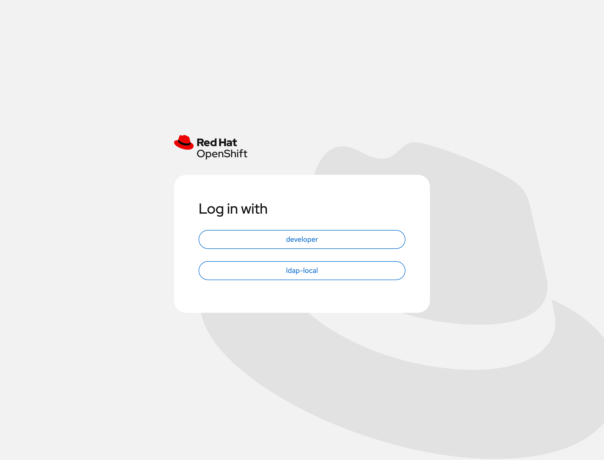
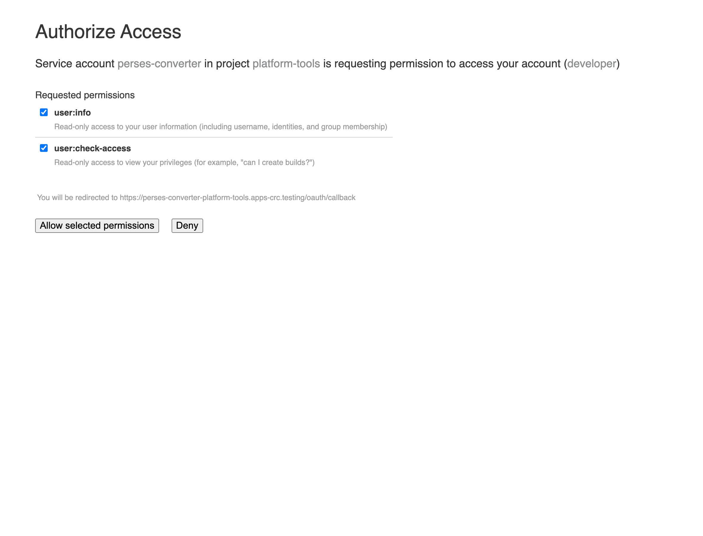
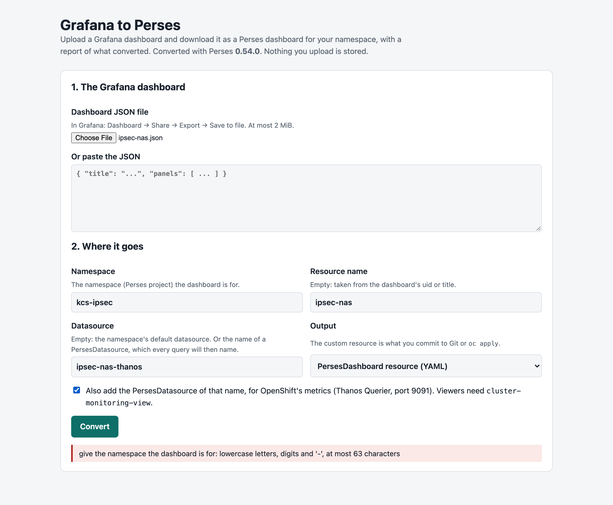
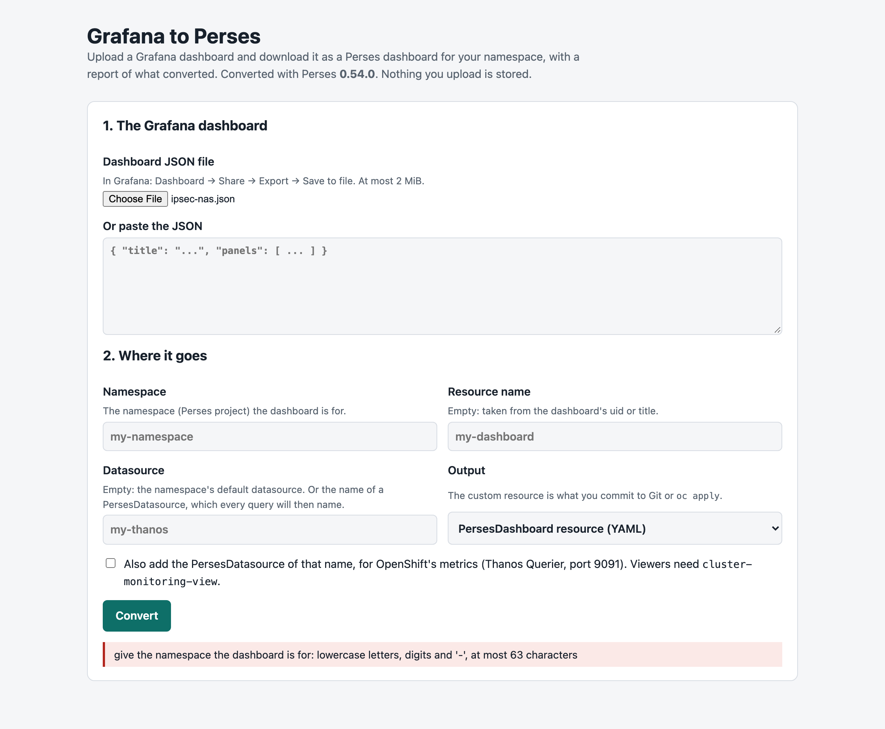

# The Grafana-to-Perses Converter Page

A web page, served from the cluster, that turns a Grafana dashboard into a Perses dashboard: upload the Grafana JSON, read what converted, download a `PersesDashboard` for your namespace. No `percli` to install and no cluster access needed to convert. It is an optional part of the [openshift-coo chart](../charts/openshift-coo/README.md), which also brings Perses itself (issue #2).

<!-- markdownlint-disable MD033 -->

<!-- markdownlint-enable MD033 -->

*The page after one conversion, captured on CRC on 2026-10-06 in a browser, through the Route, logged in as `developer`. The dark captures are beside the light ones in [`images/`](images/).*

## Turn it on

It is off by default. It needs a namespace that already exists (here `platform-tools`), and nothing else: it does not need COO to convert.

```yaml
converter:
  enabled: true
  namespace: platform-tools
```

With Helm, add those values to the release. With Argo CD, add them to the Application's `valuesObject` (the [example](../charts/openshift-coo/examples/argocd-application.yaml) shows them).

**To turn it off under Argo CD,** set `converter.enabled: false` and prune: an Application that syncs automatically without `prune` keeps the six objects, and the page stays up (measured).

**Check it:**

```bash
oc rollout status deployment/perses-converter -n platform-tools
oc get route perses-converter -n platform-tools -o jsonpath='https://{.spec.host}{"\n"}'
```

Open that address. The OpenShift login appears first; any user who can log in may use the page.

## Use it

1. Choose the Grafana dashboard JSON file (in Grafana: Dashboard → Share → Export → Save to file), or paste the JSON.
2. Give the namespace the dashboard is for.
3. Leave **Datasource** empty to use the namespace's default datasource, or give the name of a `PersesDatasource`: every query will then name it. Tick the box to also get that `PersesDatasource`, on Thanos Querier's port 9091.
4. Press **Convert**, read the report, and **Download**.
5. Commit the file to your application's repository, or apply it: `oc apply -f <file>`. The dashboard then appears under **Observe → Dashboards (Perses)** in that project.

### In pictures

One visit, captured on CRC on 2026-10-06 by [`tests/capture-converter-page.py`](../tests/capture-converter-page.py), which drives a browser through these steps.

<!-- markdownlint-disable MD033 -->
**1. The address sends you to the OpenShift login.** After it, the first time, OpenShift asks whether the page may read who you are; it asks for nothing else.

| The login | The question, the first time |
| --- | --- |
|  |  |

**2. The input:** the Grafana file, the namespace, a resource name, a datasource name, and the box that adds that datasource.



**3. The output** is the picture at the top of this document: the summary, what was adjusted, the Download and Copy buttons, every panel, and the start of the file.

**A refusal says why.** Here the namespace was left empty:


<!-- markdownlint-enable MD033 -->

### The report

The report lists every panel with its Grafana type and its Perses chart, and what to check by hand:

| The report says | Meaning |
| --- | --- |
| not converted … a text placeholder | Perses has no chart for that Grafana panel type; redraw the panel |
| Grafana transformations … are not converted | The panel used transformations; check what it shows |
| value mappings: check … | Check that mapped text still shows |
| the unit … was not carried over | Set the unit on the panel |
| a table with several queries … | Perses joins table rows only on equal labels |

Viewers of a dashboard need `view` in its namespace and `cluster-monitoring-view` for its data: [the chart README](../charts/openshift-coo/README.md).

## How it works

<!-- markdownlint-disable MD033 -->

<!-- markdownlint-enable MD033 -->

*From the address to the engine, in the order things happen. The steps are numbered in the figure and described under it.*

```text
The address: https://perses-converter-<namespace>.<apps domain>      (the Route's host; converter.route.host to choose it)

YOU, outside                 OPENSHIFT, the platform            NAMESPACE, converter.namespace
your browser  --1 https-->   Router, Route perses-converter     pod perses-converter (one pod, three containers)
                             (TLS ends and starts again) --2--> oauth-proxy :8443   the only port out of the pod
                             OpenShift login  <--3-- no session yet        |4 http, loopback, after the login
                             (any user who can log in)          web 127.0.0.1:8081  server.py + index.html, from a ConfigMap
      |6 the file                                                           |5 POST /api/migrate
      v                                                         perses 127.0.0.1:8080  the official Perses image
you, afterwards --7 oc apply, or Git--> your application's namespace
                                        (the page has no access to it)

Nothing is stored. NetworkPolicy: in, only the routers, to 8443; out, DNS and TCP 443 and 6443.
```

One pod with three containers. None of the images is built here.

| Container | Image | Role |
| --- | --- | --- |
| `perses` | The official Perses image, pulled from its copy `quay.io/ephico2real/persesdev/perses:v0.54.0` (the same digests as `docker.io/persesdev/perses:v0.54.0`) | The engine: its `/api/migrate` converts. Listens on the pod's loopback only |
| `web` | `ubi9/python-312` | The page, the report and the custom resource: `server.py` and `index.html`, mounted from a ConfigMap. Loopback only |
| `oauth-proxy` | `ose-oauth-proxy` | The OpenShift login, and the only port that leaves the pod. The Route re-encrypts to it |

`server.py` and `index.html` live in the chart under `files/converter/` and reach the ConfigMap through Helm's `.Files.Get`. A change to either restarts the pod.

**What the page adds to the engine:**

- the custom resource: `perses.dev/v1alpha2`, with the dashboard under `spec.config`, for the namespace you name;
- the report;
- with a named datasource: the name in every variable too (the engine leaves variables without one), and the unused Grafana input variable dropped. The report lists both under "Adjusted".

**What is not kept:** anything. The upload is parsed, converted and returned. The pod has a read-only root filesystem and no persistent volume; the upload is held in memory only (the one volume on the node's disk holds the engine's unpacked plugins), the request log has no bodies, and the login's session key is minted in memory at start (a restart signs everyone out; the next request logs them in again).

**The login's token.** The proxy's OAuth client is the pod's ServiceAccount, and its client secret is that ServiceAccount's token, which the proxy reads once, when it starts. The pod uses the default token mount, like any pod: the kubelet renews the file by itself, and the token the proxy read at start stays valid for a year. Chart 0.4.0 and 0.5.0 instead mounted a token of their own that was asked to expire after an hour, so an hour after the pod started every new login ended in `500 Internal Error` until the pod was restarted. If you see that on those versions, `oc rollout restart deployment/perses-converter -n <namespace>` gives another hour; chart 0.5.1 removes the cause. The ServiceAccount is bound to no Role, so its token opens nothing in the cluster.

**Health checks:** at start, a check every 5 seconds decides when the pod is Ready, and stops at its first success. After that the page and the login proxy are each checked every 30 minutes (`converter.livenessPeriodSeconds`; 900 is 15 minutes), and one failed check restarts that container. There is no other periodic check: the page converts on request, and every probe is a request it would have to serve and log. What this leaves out:

- the engine has no check of its own. If its process ends, Kubernetes restarts it; while it is away a conversion answers `503` with the reason;
- between two checks, a container that stops answering stays in the Service for up to 30 minutes.

**The upload reaches the engine as the text you gave.** The page does not re-write the JSON in the browser: a browser moves keys that look like whole numbers ahead of the others, which changed the order of value mappings such as `-1`, `0`, `1` against `percli`.

**The network policy:** in, only the routers, to the proxy's port. Out, DNS and TCP 443 and 6443, which the login needs. Converting needs no connection.

## The engine

The Perses version must be the one inside the installed COO: `converter.persesVersion`, 0.54.0 for COO 1.5.2 and 1.5.3 ([percli.md](percli.md)).

The official image's server and `percli migrate` offline give the same dashboard. Measured on the *IPsec to the NAS* dashboard (23 panels), with 0.54.0:

| Compared | Result |
| --- | --- |
| Server `/api/migrate` vs `percli migrate`, no option | Identical |
| Server with `useDefaultDatasource` vs `percli --use-default-datasource` | Identical |
| Server with `input: {DS_PROMETHEUS: <name>}` vs `percli --input DS_PROMETHEUS=<name>` | Identical |

This is the upstream image's server, not COO's own: COO's converter differs on tables ([grafana-to-perses.md](grafana-to-perses.md)).

## Values

| Value | Default | Meaning |
| --- | --- | --- |
| `converter.enabled` | `false` | Deploy the page |
| `converter.namespace` | empty: the release's namespace | Where it runs; it must exist |
| `converter.persesVersion` | `0.54.0` | The engine's version |
| `converter.livenessPeriodSeconds` | `1800` | Seconds between liveness checks, once the pod is up (30 minutes) |
| `converter.maxUploadBytes` | `2097152` | The largest upload (2 MiB) |
| `converter.thanosURL` | Thanos Querier, port 9091 | Written into the `PersesDatasource` the page can add |
| `converter.route.host` | empty: the cluster picks it | The page's hostname |
| `converter.networkPolicy.enabled` | `true` | The policy described above |
| `converter.images.*`, `converter.resources.*` | see `values.yaml` | The three images, and the requests and limits |

## Measured

On CRC 4.22.7 on 2026-10-06 ([evidence 15](evidence/crc/15-converter.txt)), in `platform-tools`:

| Check | Result |
| --- | --- |
| The pod under the restricted profile, read-only root, a random user | 3 of 3 containers Ready |
| The Route without a login | `302` to the OpenShift login; the OAuth server accepts the client and its redirect |
| `POST /api/convert` through the Route without a login | `302`, not converted |
| The ServiceAccount token | The default mount, valid 365 days; a token asked for 3600 s is valid one hour ([evidence 17](evidence/crc/17-converter-login-token.txt)). The ServiceAccount is bound to no Role |
| Out of the pod | `kubernetes.default.svc:443` connects; Thanos `:9091`, COO's Perses `:8080` and an outside address on `:80` time out |
| Into the pod from another namespace's pod | Times out |
| *IPsec to the NAS* converted in the pod | 23 of 23 panels; `spec.config` identical to `percli migrate --use-default-datasource` |
| The downloaded resource | Accepted by the cluster (`oc apply --dry-run=server` in `kcs-ipsec`) |
| Malformed JSON; a 2.2 MB upload | `400` with the reason; `413` with the limit |
| The whole visit in a browser, as `developer` | The address leads to the OpenShift login, then the question above, then the page; `POST api/convert` answers `200`; no request failed |
| The file downloaded in the browser | 23 panels identical to `percli migrate --input DS_PROMETHEUS=ipsec-nas-thanos` run in the pod; accepted by the cluster |
| Health checks in the first 4 minutes of a pod | 1 request in the page's log, the start-up check; no restart. Before the change, with a readiness check every 10 s: 60 in 10 minutes |
| Deployed by Argo CD v3.5.3: the two values added to the Application, over the objects applied by hand | Synced and Healthy 53 s after the patch; Argo CD tracks the 6 objects; the visit in a browser repeated: `200`, 23 panels identical to `percli` |
| A first install by Argo CD: the six objects deleted, then `converter.enabled: true` | Synced and Healthy, the pod ready, 37 s after the value was set; the visit in a browser repeated: `200`, 23 panels identical to `percli` in the new pod |
| Turned off under Argo CD (`converter.enabled: false`), with automatic sync and no pruning | Argo CD keeps the six objects and reports them as requiring pruning; the page stays up until they are pruned or deleted |

**Not measured:** the downloaded dashboard opened in the console, a liveness check that fails, and a login through an identity provider other than the lab's `developer`.

## Tests

```bash
tests/test-chart.sh        # the chart's rendering, the converter included
tests/test-converter.sh    # server.py against the official Perses image: needs podman or docker
```

To take the pictures again from a deployed page (needs Playwright with Chromium):

```bash
python3 tests/capture-converter-page.py https://perses-converter-platform-tools.apps-crc.testing tests/fixtures/ipsec-nas.json docs/images
```

## Change the page

Edit `charts/openshift-coo/files/converter/server.py` or `index.html`, run both test scripts, and commit. `server.py` uses the Python standard library only, so it needs no image of its own.

## Diagram sources

The figure is hand-authored SVG in [`diagrams/converter/source.html`](diagrams/converter/source.html), rendered to the two PNGs beside it with [diagram-kit](https://github.com/ephico2real2/diagram-kit) (MPL-2.0), which writes them only when its checks pass. This document and the chart README embed the light one. The picture, its text twin and the page change together:

```bash
~/.local/share/diagram-kit/.venv/bin/diagram-render docs/diagrams/converter/source.html docs/diagrams/converter converter-architecture
```
